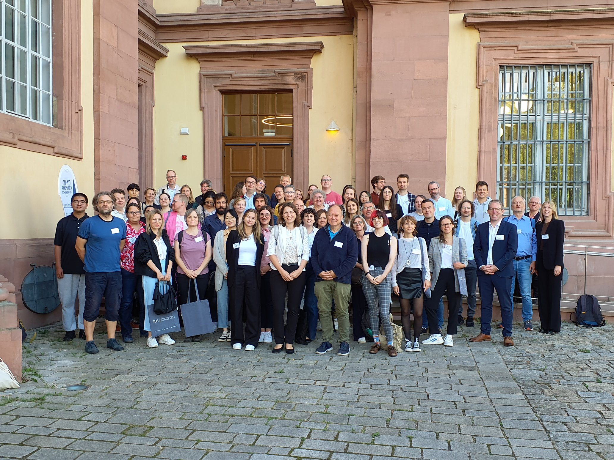

The 10th Conference on Computer-Mediated Communication (CMC) and Social Media Corpora was held in Mannheim, Germany, 14-15 September 2023. It was hosted at the University of Mannheim, Germany in collaboration with the Leibniz Institute for the German Language (IDS).

‘CMC-corpora 2023’ was the 10th edition of an annual conference series dedicated to the development, analysis, and processing of corpora of computer-mediated communication and social media for research in the humanities. The conference brought together language-centred research on CMC and social media in linguistics, communication sciences, media studies, and social sciences with research questions from the fields of corpus and computational linguistics, language and text technology, and machine learning.

## [Program & Abstracts](https://easychair.org/smart-program/CMC2023/)

## Scientific Committee

* Paul Baker (Lancaster University)
* Adrien Barbaresi (Berlin-Brandenburgische Akademie der Wissenschaften)
* Michael Beißwenger (University of Duisburg-Essen)
* Mario Cal Varela (Universidade de Santiago de Compostela)
* Steven Coats (University of Oulu)
* Luna DeBruyne (Ghent University)
* Orphée DeClercq (Ghent University)
* Francisco Javier Fernández Polo (University of Santiago de Compostela)
* Jenny Frey (European Academy of Bozen)
* Alexandra Georgakopoulou-Nunes (King's College London)
* Klaus Geyer (University of Southern Denmark)
* Aivars Glaznieks (Eurac Research Bolzano)
* Jan Gorisch (IDS Mannheim)
* Claire Hardaker (Lancaster University)
* Iris Hendrickx (Radboud University Nijmegen)
* Axel Herold (Berlin-Brandenburgische Akademie der Wissenschaften)
* Lisa Hilte (University of Antwerp)
* Mai Hodac (Université Toulouse)
* Wolfgang Imo (University of Hamburg)
* Paweł Kamocki (IDS Mannheim)
* Erik-Tjong Kim-Sang (Netherlands eScience Center)
* Alexander Koenig (CLARIN ERIC)
* Florian Kunneman (Vrije Universiteit Amsterdam)
* Marc Kupietz (IDS Mannheim)
* Els Lefever (Ghent University)
* Julien Longhi (Cergy-Paris Université)
* Maja Miličević-Petrović (University of Bologna)
* Nelleke Oostdijk (Radboud University)
* Céline Poudat (Université Côte d'Azur)
* Thomas Proisl (Friedrich-Alexander-Universität Erlangen-Nürnberg)
* Ines Rehbein (University of Mannheim)
* Sebastian Reimann (Ruhr-Universität Bochum)
* Unn Røyneland (University of Oslo)
* Jan Oliver Rüdiger (IDS Mannheim)
* Müge Satar (Newcastle University)
* Tatjana Scheffler (Ruhr-Universität Bochum)
* Stefania Spina (Università per Stranieri di Perugia)
* Egon Stemle (Eurac Research)
* Caroline Tagg (The Open University)
* Simone Ueberwasser (University of Zurich)
* Reinhild Vandekerckhove (University of Antwerp)
* Lieke Verheijen (Radboud University)

## Local Organizing Committee in Mannheim

* Andreas Witt (University of Mannheim & IDS Mannheim)
* Jutta Bopp (IDS Mannheim)
* Louis Cotgrove (IDS Mannheim)
* Laura Herzberg (University of Mannheim)
* Harald Lüngen (IDS Mannheim)
